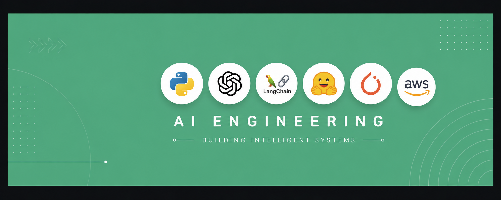

<h1 align="left">
Hi, I'm Piush Maji 👋
</h1>
<h3 align="left">
Full-Stack Developer • Aspiring AI Engineer
</h3>

 

## 👨‍💻 About Me

I'm a B.Tech CSE student and full-stack developer who enjoys turning ideas into practical digital products. I started with web development — React, TypeScript, Tailwind CSS, Supabase — and now I'm expanding into Python, AI fundamentals, LLMs, and Generative AI to build products with intelligence at their core.

**My path:** Web Development → Full Product Building → Generative AI → AI Engineering 🚀

 

## 🧰 Tech Stack

**Web & Product**
 

**Backend & Data**
 

**AI Engineering**
 

**Tools**
 

 

## 🚀 Featured Work

<table>
<tr>
<td width="50%" valign="top">

**❄️ Snowfit**
 
A modern fitness platform built for a smooth, engaging user experience.
 

</td>
<td width="50%" valign="top">

**🛍️ StoreX**
 
A clean, intuitive web app for a seamless shopping experience.
 

</td>
</tr>
<tr>
<td width="50%" valign="top">

**✨ Nexora**
 
My personal portfolio — projects, skills, and my journey as a developer.
 

</td>
<td width="50%" valign="top">

**🏥 HealFlow**
 
A healthcare-focused project built to make workflows more accessible.
 

</td>
</tr>
</table>

 

## 📊 GitHub Stats

 

## 📫 Connect With Me

---
⭐ If you find my projects useful, consider giving them a star.
