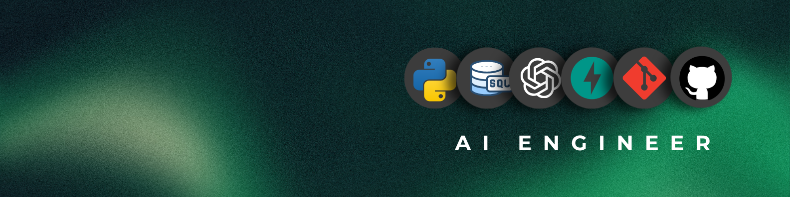

<h1 align="left">
  Piush Maji
  
</h1>

**AI Engineer · Generative AI · LLM Applications · RAG · Backend**

> Building intelligent applications at the intersection of AI, backend systems, and product engineering.

 

### About

Started in full-stack product development — shipped real applications end to end, from APIs to deployment. Now focused on AI engineering: Python, generative AI, and retrieval-augmented systems built as production software, not notebooks.

 

### My Skills

**AI / ML**
 

  
  
  
  
  
  

**Backend / Data**
 

**Frontend / Product**
 

**Tools**
 

 

### Featured Projects

<table>
<tr>
<td width="50%" valign="top">

**MedRAG Intelligence**
 
RAG-based intelligent information retrieval system — chunking, semantic search, reranking, LLM responses.
  

</td>
<td width="50%" valign="top">

**FinSight AI**
 
AI-powered financial intelligence application — transaction analysis with LLM-generated explanations.
  

  
<code>10K+ Transactions</code> · <code>5+ Workflows</code> · <code>1K+ Tests</code>

</td>
</tr>
<tr>
<td width="50%" valign="top">

**Snowfit**
 
Full-stack fitness management platform.
  

</td>
<td width="50%" valign="top">

**StoreX**
 
Full-stack e-commerce application.
  

</td>
</tr>
</table>

 

### Engineering Activity

<table>
<tr>
<td width="50%" valign="top">

**PRAHAR Community**
 
`Technical Head`
 
Building and managing technical systems for community events and digital initiatives.

</td>
<td width="50%" valign="top">

**UCGrid**
 
`Software Developer`
 
Contributing to application and platform engineering.

</td>
</tr>
</table>

 
<h2 align="left">📊 GitHub Activity</h2>

  
  

  

 

<h2 align="left">Connect</h2>

  
  &nbsp;&nbsp;
  
  &nbsp;&nbsp;
  
  &nbsp;&nbsp;
  

